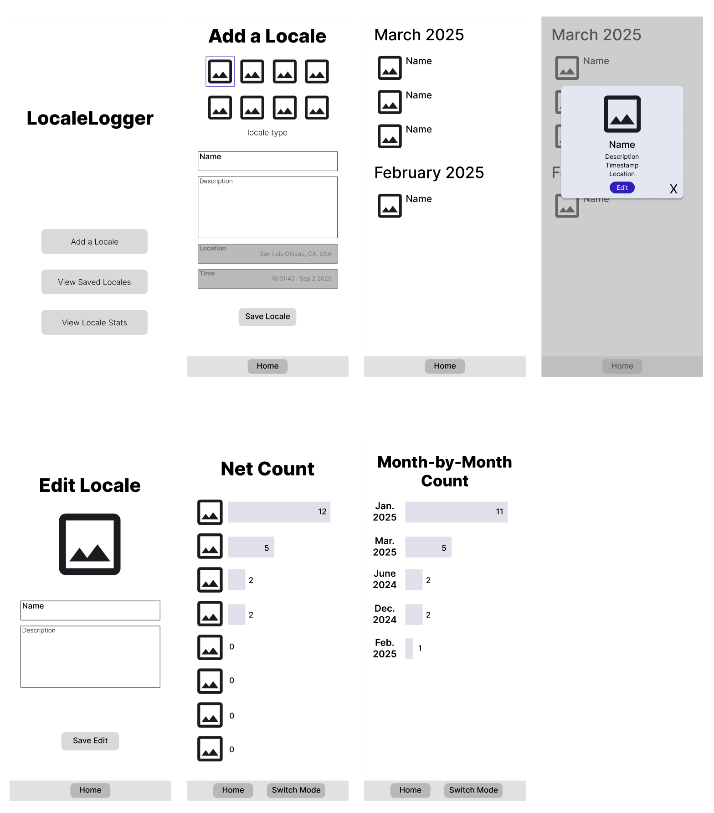

# Locale Logger

My project, `LocaleLogger` is a way for users to log which types of ‘locales’ they’ve been to. 
When adding a locale, a user can select one of 8 possible locales, add an associated title of their activity + a description before saving it to a database. 
Users can then view their saved locales in a month-by-month view. If a user clicks on a saved locale from the locales list, it shows the full description associated with it along with an option to edit said locale. 
Finally, users have an option to view their associated stats - that is, how many times they’ve visited a certain locale and what months constitute their most frequent travel. 

## Figma Mockups

## Library Usage

I used Room for database storage as I wanted some option for persistent storage for user-inputted data. 
To get user location, I used the services provided by the FusedLocationProvider. 
While I wanted to make use of location to present locales in a map view using the Mapbox API, I had trouble getting actual locations to store in the database; as such, this option remains open for future work. 
I used the default Material3 options for the UI. Otherwise, most of the app was built using built-in compose functionalities (scaffolds, app bars, spacing & text, icons, etc.).

There should be no dependencies on device features; however, since the app is programmed using Kotlin 2.0, I had to specify a version so that the room compiler could be used.
